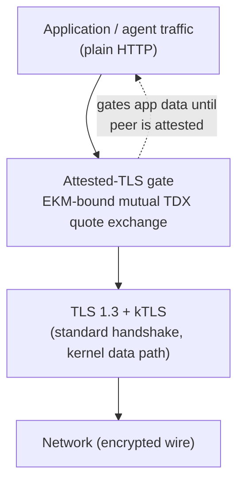
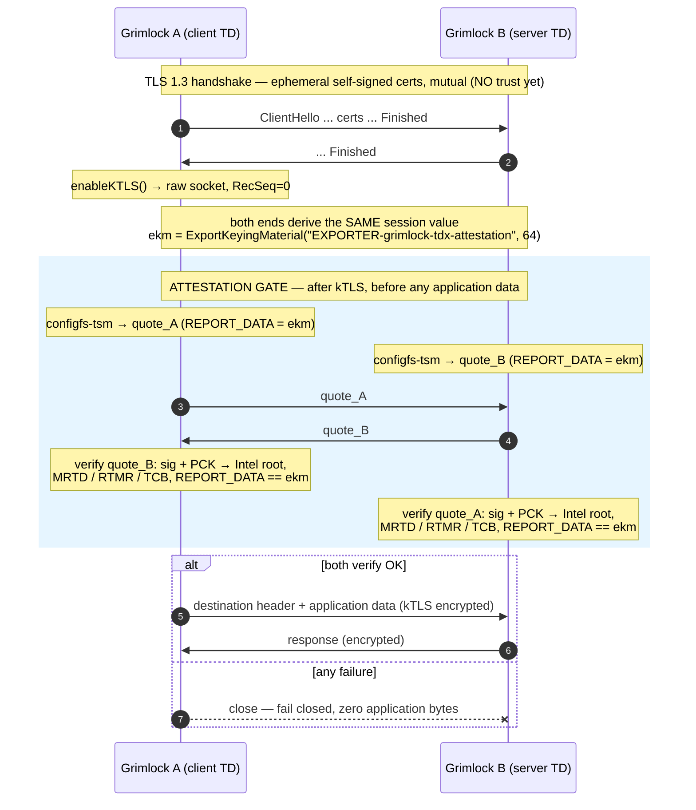
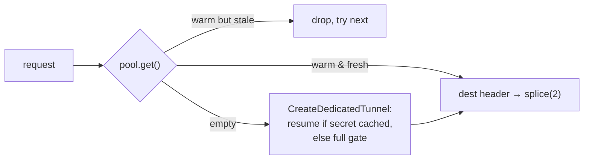
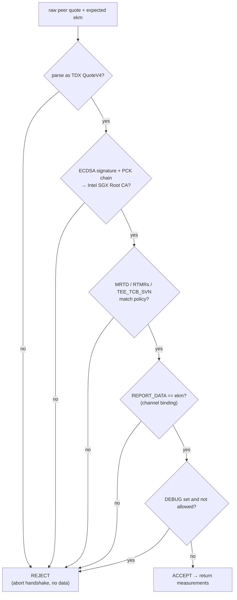
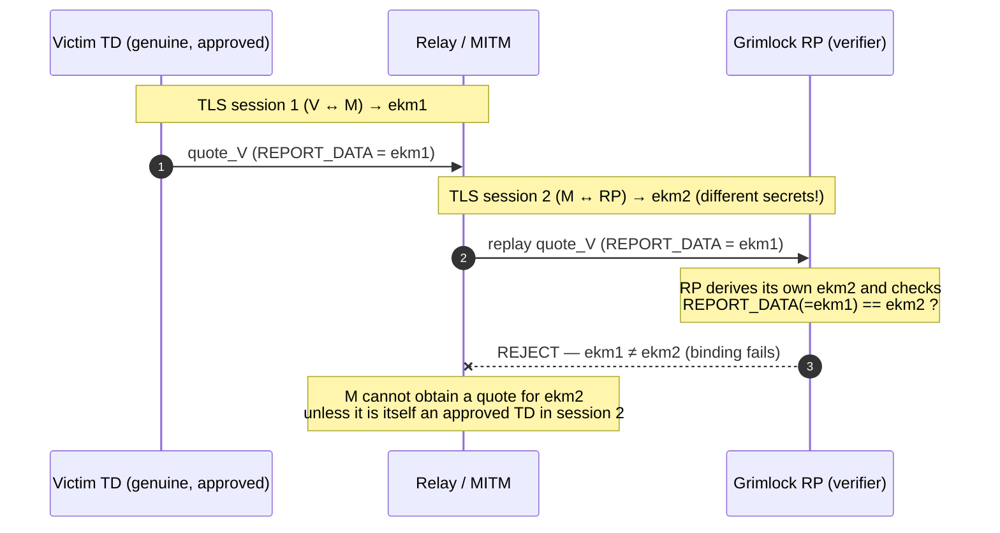

# Grimlock TDX Attestation — Design, Code Walkthrough, and Theory

> Companion to `attestation.md` (the operator guide). This document explains:
> 1. the relevant tunnel code **as it was before** attestation, line by line;
> 2. the **intra- vs post-handshake** design choice and why Grimlock uses a
>    **post-handshake attestation gate**;
> 3. **what we added, where, and why**;
> 4. the **theory** — why this construction actually protects anything.
>
> Note: an earlier iteration embedded the quote in the certificate
> (*intra-handshake* RA-TLS). We moved to the post-handshake gate described here;
> §3 explains the trade and why. Reference: `draft-usama-seat-intra-vs-post`.

---

## Part 0 — The question attestation answers

Before the change, two Grimlocks trusted each other because both presented a
certificate signed by a shared CA. That proves *"the peer holds a key signed by
our CA."* It does **not** prove the peer is running unmodified Grimlock code,
that the host/hypervisor hasn't tampered with it, or that the key can't be
stolen. TDX attestation upgrades the proof to *"the peer is a genuine Intel TDX
Trust Domain, measuring exactly image X, on this very TLS connection."*

---

## Part 1 — The code BEFORE the change (line by line)

Three pieces matter: the **server TLS config**, the **client dial config**, and
the **kTLS key extraction**. The third constrains the whole design.

### 1.1 Server trust config — original `NewTunnelManager` (tunnel.go)

```go
func NewTunnelManager(certFile, keyFile, caFile string) (*TunnelManager, error) {
	tm := &TunnelManager{ tunnels: ..., keyLog: newKeyLogWriter() } // (A)
	cert, _ := tls.LoadX509KeyPair(certFile, keyFile)               // (B) key from disk
	tm.localCert = cert
	caCert, _ := os.ReadFile(caFile)                               // (C)
	tm.caPool = x509.NewCertPool(); tm.caPool.AppendCertsFromPEM(caCert)
	tm.tlsConfig = &tls.Config{
		Certificates: []tls.Certificate{cert},        // (D) our identity
		RootCAs:      tm.caPool,                      // (E) verify peer as client
		ClientCAs:    tm.caPool,                      // (F) verify peer as server
		ClientAuth:   tls.RequireAndVerifyClientCert, // (G) demand+CHAIN-CHECK client cert
		MinVersion:   tls.VersionTLS13,               // (H) TLS 1.3 only
		MaxVersion:   tls.VersionTLS13,
		KeyLogWriter: tm.keyLog,                      // (I) capture traffic secrets
	}
	return tm, nil
}
```

- **(A)/(I)** `keyLog` captures the TLS 1.3 traffic secrets so kTLS can be set up
  later — without it, Go never exposes the symmetric keys. Remember it.
- **(B)** Identity is **loaded from disk** — whoever provisioned the file knows
  the key.
- **(C)–(G)** A shared CA is the *entire* trust anchor; `RequireAndVerifyClientCert`
  makes it mutual by chain-verifying the client.
- **(H)** TLS 1.3 pinned both ways. We keep this exactly.

### 1.2 Client dial config — original `CreateDedicatedTunnel`

```go
tm.keyLog.Reset()
clientConfig := &tls.Config{
	Certificates: []tls.Certificate{tm.localCert},
	RootCAs:      tm.caPool,            // verify server cert against CA
	MinVersion: tls.VersionTLS13, MaxVersion: tls.VersionTLS13,
	KeyLogWriter: tm.keyLog,
}
conn, _ := tls.Dial("tcp", addr, clientConfig)   // full mTLS handshake
```

### 1.3 kTLS key extraction — `crypto.go` (the design constraint)

After the handshake Grimlock pushes the negotiated keys into the kernel:

```go
clientKey, clientIV, _ := deriveTrafficKeys(clientSecret)  // HKDF-Expand-Label
serverKey, serverIV, _ := deriveTrafficKeys(serverSecret)
rawConn.Control(func(fd uintptr) {
	syscall.SetsockoptString(int(fd), solTCP, tcpULP, "tls")          // attach kTLS ULP
	txInfo := tlsCryptoInfoAESGCM128{Version: ..., CipherType: ...}
	copy(txInfo.Key[:], txKey); copy(txInfo.Salt[:], txIV[:4]); copy(txInfo.IV[:], txIV[4:12])
	// RecSeq left ZERO
	syscall.Syscall6(SYS_SETSOCKOPT, fd, solTLS, tlsTX, &txInfo, 40, 0)
	// ... TLS_RX likewise ...
})
```

Two facts dictate the design:

1. **kTLS takes over the socket immediately after the handshake.** Data then
   flows through the raw `*net.TCPConn`; the `*tls.Conn` is used only for the
   handshake and for reading `ConnectionState()`.
2. **`RecSeq` is left 0.** In TLS 1.3 each direction's application-data record
   counter resets to 0 after the handshake, so 0 is correct **iff no records are
   consumed between handshake completion and `setsockopt`.**

> **The precise constraint (this corrects an earlier overstatement):** what
> breaks kTLS is doing an attestation exchange over the **`*tls.Conn`, between the
> handshake and `setsockopt`** — that consumes records and invalidates `RecSeq=0`.
> An exchange that happens **after kTLS is enabled, over the same channel where
> application data already flows, is completely fine** — it is just encrypted
> bytes. Post-handshake attestation is therefore *compatible* with kTLS, as long
> as it is sequenced after `setsockopt`. (We also set `SessionTicketsDisabled` so
> the server's post-handshake `NewSessionTicket` doesn't land in the client's
> kTLS RX stream and bump the sequence.)

### 1.4 Grimlock already has a post-handshake gate

The original tunnel sends an **8-byte destination header** *after* the handshake
and *before* any application data:

```go
// client (handleLocalConnection): first thing written on the tunnel
dataConn.Write(destHeader)            // 4B IP + 2B port + 2B reserved
// server (handleForwardingConnection): first thing read
io.ReadFull(dataConn, header)         // gate: read control msg, THEN forward
```

This is already a *gating layer*: a defined point between "TLS up" and "app data
flows." Adding attestation as another control step in that same gate is the
natural, grain-aligned design.

---

## Part 2 — The gap we are closing

| Property | CA mTLS (before) | Needed |
|---|---|---|
| Peer holds CA-signed key | ✔ | — |
| Peer runs the expected code | ✗ | ✔ (measurement) |
| Host/hypervisor can't tamper | ✗ | ✔ (hardware TEE) |
| Key can't be exfiltrated | ✗ (on disk) | ✔ (born in TD) |
| Bound to *this* TLS channel | n/a | ✔ (no relay) |

---

## Part 3 — Intra- vs post-handshake: the design choice

`draft-usama-seat-intra-vs-post` frames exactly this fork:

- **Intra-handshake** (evidence generated *during* the handshake; e.g. quote in a
  cert extension): no extra round trip, but requires invasive cert/handshake
  handling, captures only the security posture available at handshake time, and
  **"does not bind the Evidence to the application traffic secrets"** unless done
  carefully — the draft notes this leads to **relay attacks**.
- **Post-handshake** (evidence generated *during the lifetime of the connection*):
  **no TLS changes**, **standard handshake latency**, **covers state after
  establishment**, supports **re-attestation without teardown**, and binds via
  **Exported Keying Material (EKM)** (RFC 9266 / RFC 8446 exporter). Its only cost
  is application-layer handling — *"which may be implemented in intermediary
  components (proxies, sidecars, or middleware)."*

Grimlock **is** that sidecar, and (Part 1.4) it already has the gate. So we use
the **post-handshake** model: a standard TLS 1.3 handshake with an ephemeral
cert, then — after kTLS — a mutual TDX-quote exchange bound to the session via
EKM, gating the destination header and all application data.

We chose **one-time** attestation (once per connection, before any data). The
gate is structured so periodic **re-attestation** can be added when tunnels
become long-lived/pooled — the draft's headline benefit and intra-handshake's
blind spot.

The draft's *"TLS → Attested-TLS library → Application"* layering, in Grimlock:



---

## Part 4 — The code we ADDED (line by line)

New files `internal/attest/cert.go` and `gate.go`; the reusable `attest.go`
(interfaces, `Policy`, `TDXVerifier`) and `quoter.go` (configfs-tsm) are
unchanged from the first iteration.

The end-to-end flow:



### 4.1 `cert.go` — the handshake cert carries no trust

```go
func GenerateEphemeralCert(identity string, ttl time.Duration) (tls.Certificate, error) {
	priv, _ := ecdsa.GenerateKey(elliptic.P256(), rand.Reader)   // key born in-process/TD
	tmpl := &x509.Certificate{ Subject: pkix.Name{CommonName: identity}, ... } // NO quote ext
	der, _ := x509.CreateCertificate(rand.Reader, tmpl, tmpl, &priv.PublicKey, priv)
	...
}
```

Self-signed, ephemeral. It exists only so the TLS 1.3 handshake completes; trust
comes entirely from the gate. The key is still born in the TD, so there is
nothing on disk to steal.

### 4.2 `gate.go` — mutual attestation, with freshness and a barrier

```go
const EKMLabel = "EXPORTER-grimlock-tdx-attestation"   // RFC 8446 exporter label

// Exporter derives REPORT_DATA from the session's EKM, optionally salted with a
// per-round nonce (context) for re-attestation freshness.
type Exporter func(context []byte) ([ReportDataSize]byte, error)

func (g *GateConfig) Run(conn net.Conn, exp Exporter, isClient, fresh bool) (*Measurements, error) {
	var ctx []byte
	if fresh {                                   // (1) re-attestation: exchange nonces,
		myNonce := random(32)                    //     canonical-order them, salt the EKM
		peerNonce := exchangeFixed(conn, myNonce)
		ctx = order(isClient, myNonce, peerNonce)
	}
	rd, _ := exp(ctx)                            // (2) binding value = EKM(ctx)
	myQuote, _ := g.Quoter.Quote(rd)             // (3) OUR quote commits REPORT_DATA = rd
	peerQuote, _ := exchangeFrame(conn, myQuote) // (4) swap quotes (concurrent r/w)
	m, verr := g.Verifier.Verify(peerQuote, rd)  // (5) appraise peer (sig+PCK, policy, rd)

	local := ackOK; if verr != nil { local = ackNAK }
	peerVerdict := exchangeFixed(conn, []byte{local}, 1)   // (6) MUTUAL BARRIER
	if verr != nil { return nil, verr }                    //     we rejected peer → fail
	if peerVerdict[0] != ackOK { return nil, errPeerRejectedUs } // peer rejected us → fail
	return m, nil
}
```

- **(1) Freshness.** EKM is **constant for the life of a TLS session**, so a
  *re-attestation* round on an existing session must add entropy or it would be
  replayable. We exchange 32-byte nonces and fold them into the exporter
  `context` (RFC 8446 allows this), so each round's `rd` is unique *and* still
  session-bound. The first round of a fresh session passes `fresh=false`
  (`ctx=nil`) — the new session's EKM is already unique.
- **(5)** `Verifier.Verify` is the **unchanged `TDXVerifier`** — sig + PCK chain
  to Intel root, measurement policy, and `REPORT_DATA == rd` (the binding).
- **(6) The barrier (fixes the honest-risk).** Each side announces its verdict
  and learns the peer's. `Run` returns success **only if we accepted the peer
  AND the peer accepted us.** So a side whose own appraisal passed still aborts
  if the peer NAK'd it — neither emits application data unless *both* appraisals
  passed. (Unit test: `TestGate_BarrierBlocksWhenPeerRejects`.)

### 4.3 `tunnel.go` — wiring the gate

The handshake config drops CA chaining; trust moves to the gate:

```go
func (tm *TunnelManager) initAttested(ac *AttestConfig) (*TunnelManager, error) {
	cert, _ := attest.GenerateEphemeralCert(ac.Identity, ac.CertTTL)
	tm.localCert = cert; tm.attestEnabled = true; tm.measureOnly = ac.MeasureOnly
	tm.gate = &attest.GateConfig{Quoter: ac.Quoter, Verifier: ac.Verifier, Timeout: ac.Timeout}
	tm.tlsConfig = &tls.Config{
		Certificates:           []tls.Certificate{cert},
		ClientAuth:             tls.RequireAnyClientCert, // mutual, but NOT chain-checked
		MinVersion: tls.VersionTLS13, MaxVersion: tls.VersionTLS13,
		SessionTicketsDisabled: true,                     // keep client kTLS RX clean
		KeyLogWriter:           tm.keyLog,                // kTLS still works, unchanged
	}
	return tm, nil
}
```

The gate runner derives the EKM and runs the exchange:

```go
func (tm *TunnelManager) runGate(tlsConn *tls.Conn, dataConn net.Conn, role string) error {
	state := tlsConn.ConnectionState()
	ekmBytes, _ := state.ExportKeyingMaterial(attest.EKMLabel, nil, attest.ReportDataSize) // (A)
	var ekm [attest.ReportDataSize]byte; copy(ekm[:], ekmBytes)
	m, err := tm.gate.Run(dataConn, ekm)                                                   // (B)
	if err != nil { return err }
	log.Printf("[ATTEST] peer attested (%s): MRTD=%x", role, m.MRTD)
	return nil
}
```

- **(A)** `ExportKeyingMaterial` is RFC 8446 keying-material export; both ends with
  the same label/length get identical bytes for the same session. This is the
  binding value.
- **(B)** runs over `dataConn` — the raw kTLS socket on the client (kernel
  encrypts), the `tls.Conn` on the server (user-space). Either way it's encrypted.

Call sites — **after kTLS, before the destination header**, fail-closed:

```go
// CLIENT (CreateDedicatedTunnel), after enabling kTLS, dataConn = tcpConn|conn:
if tm.attestEnabled {
	if gerr := tm.runGate(conn, dataConn, "client->"+peerIP); gerr != nil {
		conn.Close(); return nil, nil, fmt.Errorf("attestation gate failed: %w", gerr)
	}
}
return dataConn, conn, nil

// SERVER (handleIncomingTCP), after handshake, before handleForwardingConnection:
if tm.attestEnabled {
	if err := tm.runGate(tlsConn, tlsConn, "server<-"+peerIP); err != nil {
		log.Printf("[TUNNEL] Attestation gate failed from %s: %v", peerIP, err); return
	}
}
tm.handleForwardingConnection(tlsConn, peerIP)
```

If the gate errors, no destination header is read/written and **no application
byte flows** — fail closed.

### 4.4 Warm pool + attestation resumption (quote amortization *and* zero-copy)

Every tunnel is a **dedicated 1:1 kTLS connection** — there is no multiplexer. The
expensive TDX quote is amortized by **attestation resumption**:

```
1st conn to peer:  dial → kTLS → mode 'F' → FULL gate (quote) → cache resumption secret (TTL)
Nth conn (in TTL): dial → kTLS → mode 'R' → server acks 'R' → cheap HMAC resume (no quote)
                                            server acks 'F' → fall back to FULL gate
```

After a full gate both sides derive a per-peer secret from the session (RFC 9266
exporter, `attest.ResumptionLabel`) and cache it keyed by the peer's instance key
with a TTL = `--attest-reattest-interval`. A later connection proposes resumption;
`gate.Resume` runs a directional-HMAC handshake keyed by that secret and **bound
to the new session** (so a captured tag can't be replayed and a MITM's two legs
have different binds). It authenticates continuity of the attested identity
without a quote. When the TTL lapses the next connection full-gates, re-checking
the measurement policy — the same freshness window as periodic re-attestation, but
with no long-lived multiplexed session.

`pool.go` keeps **N warm, already-established tunnels** per peer; a request checks
one out (setup already paid, off the critical path) and a background `refill()`
(cheap — resumes) replaces it. A warm tunnel older than the TTL is dropped.



### 4.5 Zero-copy data plane (`dataplane.go`)

Because every tunnel is dedicated and both ends are `*net.TCPConn`, once
authorization is done the forward path is `relay` → Go's `splice(2)` — a kernel
socket-to-socket move with **no userspace copy**. This is only possible *because*
there is no multiplexer (a multiplexed stream must be demuxed in userspace and
cannot splice). Resumption gives amortized attestation; dedicated + splice gives
the zero-copy data plane; together they resolve the mux-vs-splice tension.

### 4.6 Draft §5 gap closure

| Draft benefit | Before | Now |
|---|---|---|
| 5.1.1 Full claims availability | attest at t=0 only | full gate re-checks MR/RTMR/TCB whenever the resumption TTL lapses; post-handshake captures runtime RTMRs at connect |
| 5.1.3 State-after-establishment | one-time only | bounded-stale: warm tunnels older than the TTL are dropped; full gate on TTL lapse |
| 5.1.5 Avoid extra round trips | full gate every request | warm pool pays setup ahead of time; subsequent connections **resume** (no quote) |
| Quote-count amortization | one quote per request | **one quote per TTL window** via resumption; every tunnel still splices |
| Data-plane overhead | userspace copy | `splice(2)` zero-copy (dedicated tunnels) |
| Honest-risk: mutual barrier | each side proceeded on its own verdict | ACK barrier — neither emits data until **both** appraisals pass |

---

## Part 5 — Why this design (decision log)

| Decision | Rejected alternative | Why |
|---|---|---|
| **Post-handshake** gate | Intra-handshake quote-in-cert | Matches the draft + Grimlock's existing gate; no cert/TLS surgery; covers post-establishment state; path to re-attestation. |
| Run gate **after kTLS**, over the data channel | Exchange over `tls.Conn` before `setsockopt` | Only the latter breaks `RecSeq=0`. After kTLS it's just encrypted bytes (Part 1.3). |
| Bind via **EKM** in REPORT_DATA | Bind via cert-pubkey hash | EKM ties evidence to the *session's* exporter secret (RFC 9266), the draft's recommended binding; immune to cert swapping. |
| **Ephemeral** self-signed handshake cert | Keep CA / put quote in cert | Trust is the gate; the cert only needs to make TLS run. Key still born in-TD. |
| `RequireAnyClientCert` + `InsecureSkipVerify` | `RequireAndVerifyClientCert` / default verify | We want a mutual handshake but defer *all* trust to the gate. |
| `SessionTicketsDisabled` | default (tickets on) | Prevents the server's post-handshake ticket from desyncing the client's kTLS RX `RecSeq`. |
| **Mutual** exchange (both quote) | One-sided | Each side must prove it's a genuine approved TD; A2A is peer-to-peer. |
| Fail closed on gate error | Fall back to plaintext/CA | A failed attestation must not silently downgrade. |

---

## Part 6 — The theory: why this actually protects

### 6.1 What a TDX quote is

A hardware-signed statement with two halves:

- **Measurements (who/what is running):** `MRTD` (hash of the TD's initial memory
  image — different code ⇒ different MRTD), `RTMR0..3` (runtime-extended
  registers, like TPM PCRs), `TEE_TCB_SVN`/`MRSEAM` (TDX-module security version),
  `TD_ATTRIBUTES` (incl. the DEBUG bit — a debuggable TD leaks its own memory).
- **`REPORT_DATA` (64 app-chosen bytes):** carried verbatim into the signed quote
  — the field we set to the session EKM.

The quote is signed by an attestation key certified by Intel's **PCK certificate
chain**, rooting in the **Intel SGX Root CA**. Verifying that chain proves the
statement came from genuine Intel silicon running a real TDX module — unforgeable
in software.

### 6.2 The appraisal (RATS background-check model)

`TDXVerifier.Verify` runs four stages: **structure** (parse QuoteV4) → **authenticity**
(signature + PCK chain to Intel root) → **policy + binding** (MRTD/RTMR/TCB match,
and `REPORT_DATA == ekm`) → **safety** (DEBUG off). Stages 1–2 answer "is this
genuine Intel evidence?"; stages 3–4 answer "is it the *right* TD, on *this*
connection, and safe?"



### 6.3 The binding theorem (why no relay/MITM)

Two independent facts compose:

- **Fact A (TLS):** both endpoints that completed *this* TLS 1.3 session can
  compute its EKM; **no one outside the session can** (it derives from the
  exporter-master-secret, a product of the handshake both parties contributed
  entropy to and which is never sent on the wire).
- **Fact B (TDX):** a valid quote with `REPORT_DATA = ekm` means a genuine,
  policy-approved TD asserted *"I am bound to the TLS session whose EKM is `ekm`."*

We recompute `ekm` ourselves from our end of the session and require the peer's
quote to carry exactly that. So:

> The peer is a genuine approved TD **and** it proved knowledge of *this* session's
> EKM. Therefore the TD is an actual endpoint of this very TLS connection — not a
> relay.

Why a relayed quote is refused — the EKMs of two different sessions never match:



Attacks:

- **Relay / quote replay.** Attacker forwards a real TD's quote captured from a
  *different* session (EKM = `ekm'`). We require `ekm` (ours). `ekm ≠ ekm'` →
  rejected. The attacker cannot obtain a quote for our `ekm` unless it is itself
  an approved TD *in our session* — i.e. a legitimate endpoint. **Blocked.**
- **MITM / TLS-terminating proxy.** The proxy has two sessions, each with a
  different EKM. A quote bound to the TD↔proxy EKM won't match the proxy↔peer EKM.
  **Blocked.**
- **Tampered code in a real TD.** Quote is authentic but `MRTD`/`RTMR` ≠ policy →
  rejected at stage 3 (this is why pinning `--attest-mrtd` matters). **Blocked.**
- **Key theft.** No key on disk; the ephemeral key and the TD memory are
  hardware-protected from the host. **Nothing to steal.**

### 6.4 Why kTLS is safe (non-interference)

The gate runs **after** `setsockopt(TLS_TX/RX)`, over the same channel the
destination header already used. No records are consumed between handshake and
`setsockopt`, so `RecSeq=0` holds; `SessionTicketsDisabled` keeps the client RX
stream free of tickets. The data path — raw `*net.TCPConn`, kernel crypto — is
byte-for-byte unchanged. Attestation is a control step layered *in front of* the
application data, inside the existing gate.

### 6.5 What is NOT protected (scope)

- **Post-attestation in-TD runtime bugs** — attestation proves what booted/was
  measured, not memory safety thereafter. Keep the image minimal; measure what
  matters into RTMRs.
- **Availability** — fail-closed by design; a missing TD or bad collateral means
  no tunnel.
- **TCB currency** unless `--attest-get-collateral` (offline mode proves
  authenticity + measurements, not microcode/TDX-module currency).
- **The local plaintext hop** (agent↔Grimlock inside the TD) — co-locate them in
  one TD so that hop stays inside the trust boundary.
- **Re-attestation granularity** — a resumption secret is valid for
  `--attest-reattest-interval`; within it, connections resume cheaply, and once it
  lapses the next connection full-gates (re-checking MR/RTMR/TCB). So the window
  between full measurement re-checks is bounded by the TTL; a compromise
  mid-window is caught at the next full gate, and the mutual barrier still
  guarantees no application data before the (full or resume) handshake passes.

---

## One-paragraph summary

Before, trust was "holds a CA-signed cert," decided in the handshake and followed
by a fragile kTLS handoff. Grimlock already ran a post-handshake gate (the
destination-header exchange), so we put attestation there: a standard TLS 1.3
handshake with a throwaway ephemeral cert, then — after kTLS, before any
application byte — a mutual TDX-quote exchange whose `REPORT_DATA` carries the
session's Exported Keying Material. The quote proves genuine Intel hardware (PCK
chain) running approved code (MRTD/RTMR policy), and the EKM ties that proof to
*this* TLS session, so a relayed or proxied quote — bound to a different session
— is refused. The key is born inside the hardware-encrypted TD, so there is
nothing to steal and nothing to replay, and the kTLS data path is untouched.
