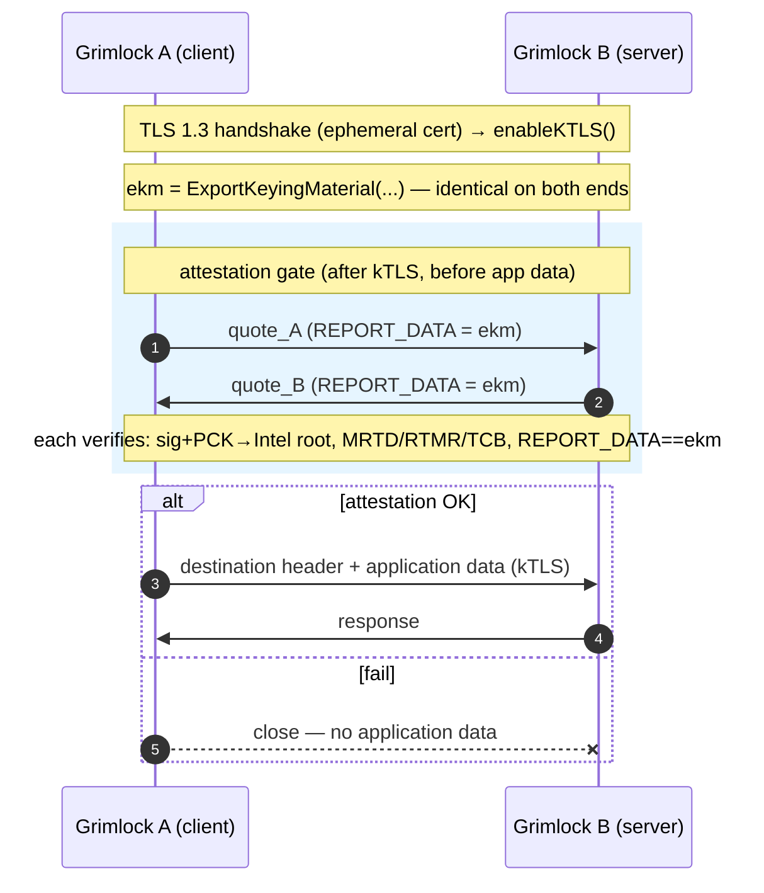
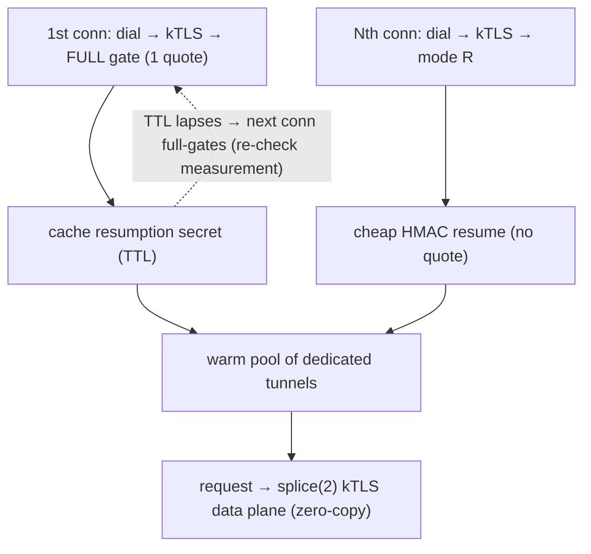

# Grimlock TDX Remote Attestation (post-handshake gate)

> Operator guide for the `--attest` mode added in `internal/attest`.
> Design/theory: `attestation-design.md`.

## What it does

When `--attest` is set, Grimlock authenticates peer Grimlocks by their **Intel
TDX hardware quote** instead of a shared CA, using a **post-handshake attestation
gate** (per `draft-usama-seat-intra-vs-post`):

1. A standard TLS 1.3 handshake completes using an **ephemeral self-signed cert**
   (key born inside the TD). Trust is *not* established here.
2. kTLS is enabled exactly as before.
3. **After kTLS, before any application data**, both sides derive the session's
   **Exported Keying Material** (`EKM = ExportKeyingMaterial("EXPORTER-grimlock-
   tdx-attestation", …, 64)`) and request a TDX quote with `REPORT_DATA = EKM`
   (via `configfs-tsm`).
4. The peers **exchange quotes** over the established channel; each verifies the
   other's quote:
   - signature + PCK certificate chain to the Intel SGX Root CA,
   - measurement **policy** (MRTD / RTMRs / TCB / debug),
   - `REPORT_DATA == our EKM` — the **channel binding** that defeats relay / MITM.
5. Only on success does the destination header / application traffic flow. Any
   failure closes the connection (**fail closed**).

The gate runs in the same place Grimlock already exchanged its destination
header, so the kTLS data path is unchanged. The key is born in the TD, and the
EKM binds the quote to *this* session, so a replayed/relayed quote is refused.



This is **one-time** attestation (once per connection, before data). Re-attestation
for long-lived/pooled tunnels is a planned extension of the same gate.

## Prerequisites

- Grimlock must run **inside a TD** (a TDX confidential VM). Attestation is not
  possible on a bare host — `--attest` fails closed with
  "TDX quoting unavailable" if there is no `tdx_guest` TSM provider.
- Kernel **6.7+** in the guest (for the `configfs-tsm` quote interface) with the
  `tdx_guest` driver loaded; `/sys/kernel/config/tsm/report` available.
- For TCB-status evaluation (`--attest-get-collateral`), outbound network to an
  Intel PCS/PCCS endpoint. Default verification is **offline** (signature +
  measurements only; the quote carries its own PCK chain to the embedded root).

## Bootstrap: capture golden measurements

You can't pin `MRTD`/`RTMR` values until you know them. Run one side in
**measure-only** mode and let the peer connect:

```bash
# On host B (verifier), bootstrap:
sudo ./grimlock --attest --attest-measure-only \
    --peers=<host-a-ip>

# Logs on the first peer handshake:
# [ATTEST] MEASURE-ONLY: peer CN="grimlock-td" quote verified+bound; observed measurements:
#     --attest-mrtd=ab12...   (48 bytes)
#     --attest-rtmr0=...
#     --attest-rtmr1=...
#     # TEE_TCB_SVN observed: 0e00... (pin a floor via --attest-min-tcb-svn)
```

Measure-only still verifies the quote signature **and** the REPORT_DATA binding
(so the values you capture genuinely came from that peer) — it only skips
*policy enforcement* and permits debug TDs. **Do not run measure-only in
production.**

## Enforce a policy

Drop `--attest-measure-only` and pin the captured values on both peers:

```bash
sudo ./grimlock --attest \
    --attest-identity=grimlock-td-a \
    --attest-mrtd=<48-byte hex> \
    --attest-rtmr0=<48-byte hex> \
    --attest-get-collateral \          # evaluate TCB status (needs PCS/PCCS)
    --attest-min-tcb-svn=<16-byte hex> \
    --peers=<peer-ip>
```

Pin **at least `--attest-mrtd`** (the build-time image measurement). Pin the
RTMRs you actually control/extend. A missing `--attest-mrtd` is allowed but
logs a loud warning — the quote is still cryptographically verified, but *any*
genuine TD would pass.

## Flags

| Flag | Meaning |
|---|---|
| `--attest` | Enable post-handshake TDX attestation (otherwise shared-CA mTLS). |
| `--attest-identity` | CommonName for the ephemeral TLS cert (cosmetic; not chain-verified). |
| `--attest-mrtd` | Required peer `MR_TD`, 48-byte hex. Empty = not pinned (warned). |
| `--attest-rtmr0..3` | Required peer `RTMR0..3`, 48-byte hex each. Empty = skip. |
| `--attest-min-tcb-svn` | Minimum peer `TEE_TCB_SVN`, 16-byte hex. Empty = skip. |
| `--attest-allow-instance-key` | Allowlist of authorized peer instance keys (hex SHA-256 of TLS SPKI). Realizes `Policy says K ⇒ TrustedPeer`. Empty = accept any instance with a golden measurement. |
| `--attest-agent-measurement` | This host's *agent-code* measurement (hex), advertised + bound into the quote — decouples "which agent" from "which Grimlock". Hardware-rooted when set equal to an RTMR the agent extends at launch. |
| `--attest-peer-agent-measurement` | Required peer agent measurement (hex); empty = not enforced. |
| `--attest-allow-debug` | Accept debuggable peer TDs. **INSECURE**; off by default. |
| `--attest-get-collateral` | Fetch PCS collateral to evaluate TCB status. Needs network. |
| `--attest-check-revocations` | Reject revoked PCK certs (requires `--attest-get-collateral`). |
| `--attest-measure-only` | Bootstrap: verify+bind, log measurements, enforce nothing. |
| `--attest-cert-ttl` | Lifetime of the ephemeral TLS cert (default 24h). |
| `--attest-timeout` | Deadline for the gate quote exchange (default 10s). |
| `--attest-channel-depth` | Warm, pre-established dedicated tunnels kept per peer (default 2; ≥1). Independent connections ⇒ no head-of-line blocking; each splices. |
| `--attest-reattest-interval` | Resumption-secret TTL **and** warm-tunnel max-idle: after this, a full gate (re-checking measurement) is required instead of a cheap resume. (0 = never re-check.) |

## What the quote commits to (binding)

`REPORT_DATA` is `EKM(transcript)` where the transcript (`internal/authz`, one
canonical injective encoding — see [model.md](model.md)) commits to: the TLS
session (EKM), the per-round nonces, **both instance keys** (SHA-256 of each
end's TLS SPKI), **both capability-manifest digests**, and **both agent
measurements**. So a quote is bound to *this* channel, *this* instance, *this*
advertised capability set, and *this* agent — a quote captured from another
session/instance/manifest/agent is rejected.

- **Measurement** (`MR_TD`/`RTMR`) authenticates the *Grimlock code*.
- **Instance key** (`--attest-allow-instance-key`) authenticates *which TD* and
  authorizes it (`Policy says K ⇒ TrustedPeer`). Without an allowlist, trust is
  closed-membership-by-measurement: any TD with the golden image is accepted.
- **Agent measurement** (`--attest-agent-measurement` / `--attest-peer-agent-measurement`)
  authenticates the *application behind* Grimlock, independent of the Grimlock
  version — see the trust boundary in [threat-model.md §3](threat-model.md).

## Verification depth: offline vs collateral

- **Offline (default).** Verifies the ECDSA quote signature and the PCK cert
  chain to the embedded Intel SGX Root CA, plus measurements + binding. Does
  **not** evaluate TCB status (microcode/TDX-module currency) or revocation.
  No network required.
- **`--attest-get-collateral`.** Additionally pulls TCB info / QE identity from
  Intel PCS (or a PCCS cache) and evaluates TCB status. Add
  `--attest-check-revocations` to also enforce PCK CRLs. This is the production
  recommendation; run a local **PCCS** so peers don't depend on Intel PCS
  reachability at handshake time. (PCCS is a collateral *cache*, not a verifier —
  it is not the same as an external attestation service.)

## Per-peer channel: dedicated tunnels + attestation resumption

Every peer is reached through one abstraction — `channelFor(peer).stream()` — a
**warm pool of dedicated, 1:1 kTLS tunnels**. There is no multiplexer: every
tunnel carries one request and both ends are `*net.TCPConn`, so the data plane
rides `splice(2)` (zero-copy — see [architecture.md](architecture.md)).

The reason multiplexing existed — amortizing the expensive TDX quote — is instead
provided by **attestation resumption**, which keeps the data plane zero-copy:

- The **first** connection to a peer runs the full gate (quote exchange) and both
  sides derive a **resumption secret** from the session (RFC 9266 exporter),
  cached keyed by the peer's instance key with a TTL.
- **Subsequent** connections send mode `R`; if the server still holds the secret,
  both run a cheap HMAC handshake (`gate.Resume`) bound to the new session — **no
  quote**. Otherwise both fall back to a full gate (mode `F`).
- The secret's **TTL = `--attest-reattest-interval`**; when it lapses, the next
  connection does a full gate, re-checking measurement — same freshness window as
  the old periodic re-attestation, but without a long-lived multiplexed session.

The pool is **warm** (setup — full or resumed — happens ahead of the request) and
**self-healing** (a dropped tunnel is re-established, cheaply via resume). A warm
tunnel whose attestation is older than the TTL is dropped and replaced. Depth ≥ 2
(default) spreads load across independent connections — **no head-of-line
blocking** (unlike a single multiplexed session).



This gives **both** amortized attestation (resumption) **and** a zero-copy data
plane (splice), with no multiplexer — resolving the fundamental mux-vs-splice
tension (a multiplexed stream must be demuxed in userspace and cannot splice).

| Connection | Quote cost | Data plane |
|---|---|---|
| first to a peer (or after TTL) | full gate (1 quote) | `splice(2)` (zero-copy) |
| subsequent within TTL | **cheap resume (no quote)** | `splice(2)` (zero-copy) |

## Trust model vs CA mode

| | CA mTLS (default) | TDX attestation (`--attest`) |
|---|---|---|
| Identity root | shared CA cert | Intel TDX roots + measurement policy |
| What's proven | "holds a CA-signed cert" | "genuine TD running image MRTD=…, bound to this session" |
| Key provenance | loaded from disk | ephemeral, born inside the TD, never exported |
| Channel binding | none beyond TLS | EKM in quote `REPORT_DATA` (RFC 9266-style) |
| Per-agent identity | host-granular | TD-granular (each agent TD = its own measured identity) |

Attestation upgrades identity from "shares a CA key" to "is hardware-attested
running the approved image, on this very connection," and (when each agent runs
in its own TD) makes the identity per-agent and cryptographic rather than
host-shared.

## Implementation map

| File | Role |
|---|---|
| `internal/attest/attest.go` | `Quoter`/`Verifier` interfaces, `Policy`, `TDXVerifier` (go-tdx-guest: parse → verify sig/PCK → validate policy+binding → debug guard). |
| `internal/attest/quoter.go` | `ConfigfsQuoter` (configfs-tsm); `Available()` preflight. |
| `internal/attest/cert.go` | `GenerateEphemeralCert` — throwaway self-signed cert for the handshake (no embedded evidence). |
| `internal/attest/gate.go` | `GateConfig.Run` — mutual quote exchange bound via `Exporter`, **mutual ACK barrier**, framing; `Resume` — cheap HMAC resumption handshake; `EKMLabel`/`ResumptionLabel`; `FormatMeasurements`. |
| `cmd/grimlock/pool.go` | `tunnelPool` — warm pool of dedicated tunnels + `streamHandle`; drops tunnels older than the resume TTL. |
| `cmd/grimlock/tunnel.go` | gate/resume orchestration: `CreateDedicatedTunnel`/`clientAttest`, `serverAttest`, `runGate`/`runResume`, `resumeCache`. |
| `cmd/grimlock/dataplane.go` | `relay`/`spliceable` — the zero-copy data plane. |
| `cmd/grimlock/main.go` | `--attest*` flags, `buildAttestConfig`, pool wiring. |

> **Binding label:** the gate uses the exporter label
> `EXPORTER-grimlock-tdx-attestation`. Both peers run Grimlock so they agree by
> construction; keep it stable across versions that must interoperate.
