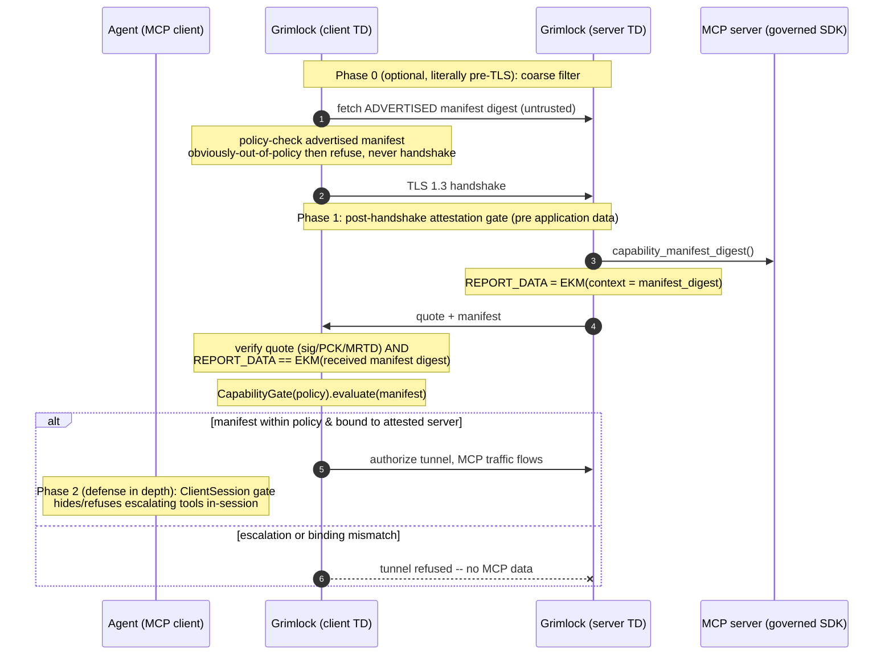

# MCP Capability Governance over the Grimlock Tunnel

> How the (forked) MCP SDK's capability/scope governance cooperates with the
> Grimlock attested tunnel, and what "check before the TLS handshake" means in
> practice.

## Why this lives in the SDK now (not a side package)

A bolt-on gate is opt-in and bypassable — a client can simply not call it. We
moved enforcement **into the SDK** (`mcp.security`) so the contract is
**mandatory**:

- **Server MUST follow** — `ToolContract` runs at tool registration
  (`MCPServer`/`ToolManager.add_tool`). A tool whose docstring lacks
  `Capability:`/`Scope:` or falls outside **[200, 500]** chars **cannot be
  published** (`ToolContractError`). Default-on; opt out with
  `ToolContract.disabled()`.
- **Client MUST follow** — `ClientSession(capability_policy=…)` runs the
  `CapabilityGate` inside `list_tools` (escalating tools are **hidden** from the
  agent) and inside `call_tool` (un-gated/escalating names are **refused** with
  `CapabilityError`). A tool can't be called before it's been gated.

The original `./mcp-capability-gate` package is superseded by `mcp.security`.

## The timing problem

MCP tool descriptions are obtained **after** connecting (`tools/list`), which is
*inside* the session, *over* the tunnel, *after* the TLS handshake. So a literal
"inspect tools before the TLS handshake" cannot be the *authoritative* check —
pre-handshake data is unauthenticated and spoofable. The resolution is a
**two-phase** gate, mirroring Grimlock's verify-before-trust stance.

## Phase 0 — coarse pre-TLS filter (the literal "before TLS handshake")

The client-side Grimlock can fetch the server's **advertised** capability
manifest (from a registry, a well-known endpoint, or cache) and run
`CapabilityGate` **before initiating the TLS handshake**. An obviously
out-of-policy server is rejected without spending a handshake. This is a
fast-fail optimization only — the advertised manifest is **untrusted**, so it
must be re-confirmed in Phase 1.

## Phase 1 — attested manifest binding (the authoritative check)

This is where governance actually binds to identity, and it reuses Grimlock's
existing gate machinery:

1. The MCP server runs the governed SDK; `MCPServer.capability_manifest_digest()`
   gives a stable SHA-256 over its `(tool, capability, scope)` set.
2. The **server-side Grimlock** binds that digest into the attestation — the
   gate's exporter context, exactly like the x402 payment binding:
   `REPORT_DATA = EKM(context = manifest_digest)`. (Alternatively, extend an RTMR
   with it so it's part of the measured boot/runtime state.)
3. During the post-handshake gate, the server sends its manifest; the
   **client-side Grimlock** verifies the quote (signature + PCK chain + MRTD/RTMR
   policy) **and** that `REPORT_DATA == EKM(received manifest digest)`. This
   proves the manifest is the *measured server's actual tool set* — the server
   can't advertise a benign manifest and serve a different one.
4. The client-side Grimlock runs `CapabilityGate(policy)` on the attested
   manifest. **Escalation ⇒ the gate fails ⇒ the tunnel is not authorized ⇒ no
   MCP application data ever flows.**

So "before the TLS handshake" = Phase 0 coarse filter; "before any MCP/tool
traffic, bound to the measured server" = Phase 1 in the gate. The strong property
holds at Phase 1 because that is the earliest point the manifest is trustworthy.

## Phase 2 — in-session gate (defense in depth)

Even after the tunnel is authorized, the `ClientSession` runs the **same**
`ClientPolicy` at `list_tools`/`call_tool`. Two enforcement points, one policy:

| Layer | Enforces | Bypassable by the agent? |
|---|---|---|
| Grimlock tunnel (Phase 1) | manifest within policy, **bound to attested server** | No (eBPF-unbypassable, pre-data) |
| `ClientSession` (Phase 2) | per-tool gate; hides + refuses escalating tools | No (in the SDK the agent uses) |

The transport gate stops a malicious/over-privileged *server*; the session gate
stops the *agent/LLM* from invoking a tool it was never granted. Both root in
attestation: the capability declarations are only trustworthy because Phase 1
proved the server runs known, measured code.

## Stateless MCP (2026-07-28, no `initialize` handshake)

The 2026-07-28 spec removes the lifecycle/`initialize` handshake (the session is
"born initialized"). **Neither enforcement layer relies on the handshake:**

- **Transport gate (Grimlock)** is entirely protocol-version-agnostic. It pulls
  the manifest out-of-band over HTTP and holds the agent's bytes until the gate
  passes — it never parses the MCP session, so the presence/absence of an
  `initialize` round trip is irrelevant.
- **`ClientSession` gate** hooks `tools/list` and `tools/call`, both of which
  still exist in 2026-07-28. It does **not** hook `initialize`. To stay robust
  when a client calls a tool **without** an explicit discovery step (no handshake
  forcing a `list_tools`), `call_tool` now **self-gates**: if a tool hasn't been
  gated yet, it **paginates** `list_tools` (until the tool is gated or the listing
  is exhausted — bounded against null/repeated cursors), then enforces. Gate
  verdicts are computed from the tool list, so removing the handshake cannot
  change them.

Tested: `test_gate_independent_of_initialize_handshake` (stateless session is
born-initialized, gate wired, verdicts protocol-agnostic) and
`test_call_without_explicit_list_gates_implicitly`. Note: the SDK's *in-memory*
transport does not yet implement 2026-07-28 request execution (a pre-existing
limitation — baseline list/call fail identically without the gate), so the
end-to-end stateless demo is limited to the gate logic.

## Why this composes with the rest of Grimlock

It's the **MCP-layer** sibling of the x402 payment gate and the TDX attestation
gate — the same pattern at three layers:

| Layer | Self-declaration | Policy check | Bound to attestation via |
|---|---|---|---|
| Transport | TD measurements (MRTD/RTMR) | measurement policy | the quote itself |
| MCP tools | `Capability:` / `Scope:` docstrings | `ClientPolicy` | `EKM(context = manifest_digest)` |
| Payments | x402 `X-PAYMENT` terms | spend policy | `EKM(context = BindingHash)` |

Each is policy enforced **outside** the (possibly hijacked) agent, on the
unbypassable eBPF path, with the declaration made trustworthy by hardware
attestation.

## SDK surface added (fork)

| Symbol | Where |
|---|---|
| `ToolContract` (`.default()`/`.disabled()`/`.validate`) | `mcp.security` — server contract |
| `ClientPolicy`, `CapabilityGate`, `CapabilityError` | `mcp.security` — client gate |
| `MCPServer(tool_contract=…)`, `capability_manifest[_digest]()` | server |
| `ClientSession(capability_policy=…)`, `Client(capability_policy=…)` | client |

Tests: `python-sdk/tests/security/test_capability.py` (server contract; client
hide/refuse/ordering; manifest binding) — 7 passing over an in-memory session.

## Implementation status (Go tunnel side)

Phase 1 is implemented in the Go gate — the capability check is **folded into the
same atomic attestation gate**, so it completes before any agent byte is read:

- `internal/capability` — manifest parse + `Policy.Check` (dot-prefix capability
  covering, scope allowlist, escalation errors). Cross-language verified against
  the Python SDK's `capability_manifest()` JSON.
- `internal/attest/gate.go` — `GateConfig.LocalAttachment` (the manifest a host
  advertises) and `CheckPeerAttachment` (the policy check). Both peers' attachment
  digests are folded into the EKM context, so **the quote commits to the
  manifest** (swap it ⇒ quote verification fails). The policy check is evaluated
  inside the **mutual ACK barrier**: escalation ⇒ NAK ⇒ gate fails ⇒
  `CreateDedicatedTunnel` returns an error ⇒ `handleLocalConnection` drops the
  agent connection **without ever reading/forwarding it**.
- Flags: `--mcp-manifest <file>` (advertise this host's manifest),
  `--mcp-policy-capabilities` / `--mcp-policy-scopes` (enforce on the peer's
  manifest).
- **Auto-pull** (`--mcp-manifest-url`): instead of a static file, the server-side
  Grimlock pulls its manifest from the live MCP server over HTTP. The governed
  SDK exposes it via `MCPServer.mount_capability_manifest()` at
  `/.well-known/mcp-capabilities` (`MCPServer.capability_manifest_json()`).
  `internal/mcpmanifest.Puller` fetches + validates + caches the raw bytes
  (`--mcp-manifest-refresh` for background refresh), and feeds them to the gate
  via `GateConfig.LocalAttachmentFunc` so the *currently served* manifest is
  bound each round. Verified end-to-end: SDK serves → Go pulls → policy blocks
  the escalating tool.

So the "no data/tool-call before the check" guarantee holds by construction: the
manifest verification is part of the gate, and forwarding is strictly downstream
of a successful gate (fail-closed). Tests: `internal/capability` (5) and
`internal/attest` (`TestGate_AttachmentCheckBlocks`,
`TestGate_AttachmentBindsIntoReportData`).
